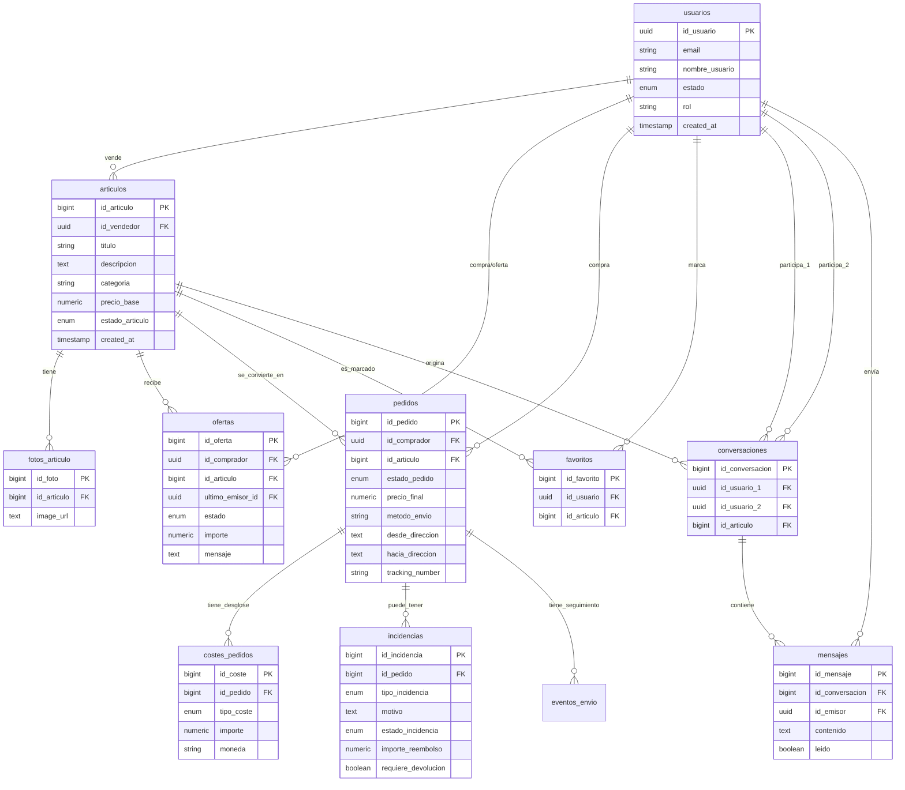

# Resumen de la Base de Datos - Proyecto Vinted Clone

Este documento describe la arquitectura, funcionamiento y esquema de la base de datos utilizada en el proyecto.

## 1. Tecnología y Arquitectura

La base de datos utiliza **PostgreSQL** y está alojada en **Supabase**. Se aprovechan varias características avanzadas de Postgres:

*   **Tipos Enumerados (ENUM):** Para restringir los estados de usuarios, artículos, pedidos y ofertas a valores específicos.
*   **UUIDs:** Sincronizados con el sistema de autenticación de Supabase (`auth.users`) para una gestión de sesiones segura.
*   **Row Level Security (RLS):** Las políticas de seguridad están implementadas directamente en la base de datos, garantizando que los usuarios solo puedan acceder o modificar los datos que les corresponden.
*   **Integridad Referencial:** Uso extensivo de claves foráneas con reglas `ON DELETE CASCADE` o `RESTRICT` para mantener la consistencia de los datos.

## 2. Entidades Principales

La base de datos se organiza en torno a las siguientes tablas:

| Tabla | Descripción |
| :--- | :--- |
| **usuarios** | Almacena el perfil básico, rol (user/admin) y estado de los usuarios. |
| **articulos** | Productos publicados para la venta, incluyendo descripción, categoría y precio. |
| **fotos_articulo** | Galería de imágenes asociadas a cada artículo. |
| **ofertas** | Registro de negociaciones de precio entre compradores y vendedores. |
| **pedidos** | Transacciones finalizadas, incluyendo direcciones de envío y estado del paquete. |
| **costes_pedidos** | Desglose de costes adicionales (envío, comisión, seguro) de un pedido. |
| **incidencias** | Gestión de reclamaciones y disputas sobre pedidos. |
| **eventos_envio** | Historial de estados por los que pasa el paquete de un pedido. |
| **conversaciones** | Agrupador de chats entre dos usuarios sobre un artículo específico. |
| **mensajes** | Contenido individual de los chats dentro de una conversación. |
| **favoritos** | Relación de artículos marcados como favoritos por los usuarios. |

## 3. Funcionamiento de los Estados (Enums)

El flujo del sistema se controla mediante diversos enums:

*   **estado_articulo:** `disponible`, `reservado`, `vendido`, `desactivado`, `eliminado`.
*   **estado_pedido:** `pendiente_pago`, `pagado`, `enviado`, `en_reparto`, `entregado`, `completado`, `cancelado`.
*   **estado_oferta:** `pendiente`, `aceptada`, `rechazada`, `caducada`.
*   **estado_incidencia:** `abierta`, `en_mediacion`, `resuelta_reembolso`, `resuelta_sin_reembolso`, `cerrada`.

## 4. Diagrama Entidad-Relación (ERD)

A continuación se presenta el diagrama completo de las relaciones entre las tablas:

